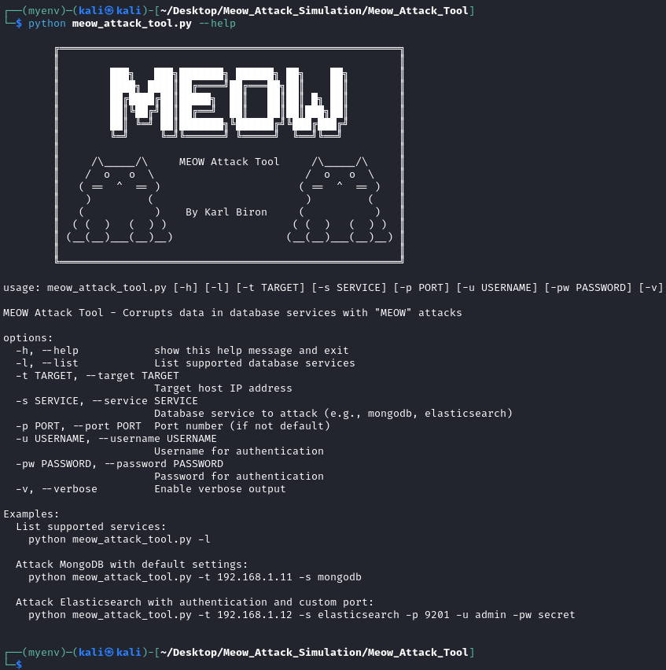
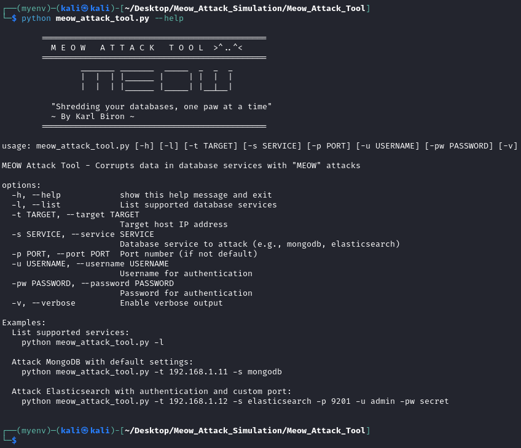
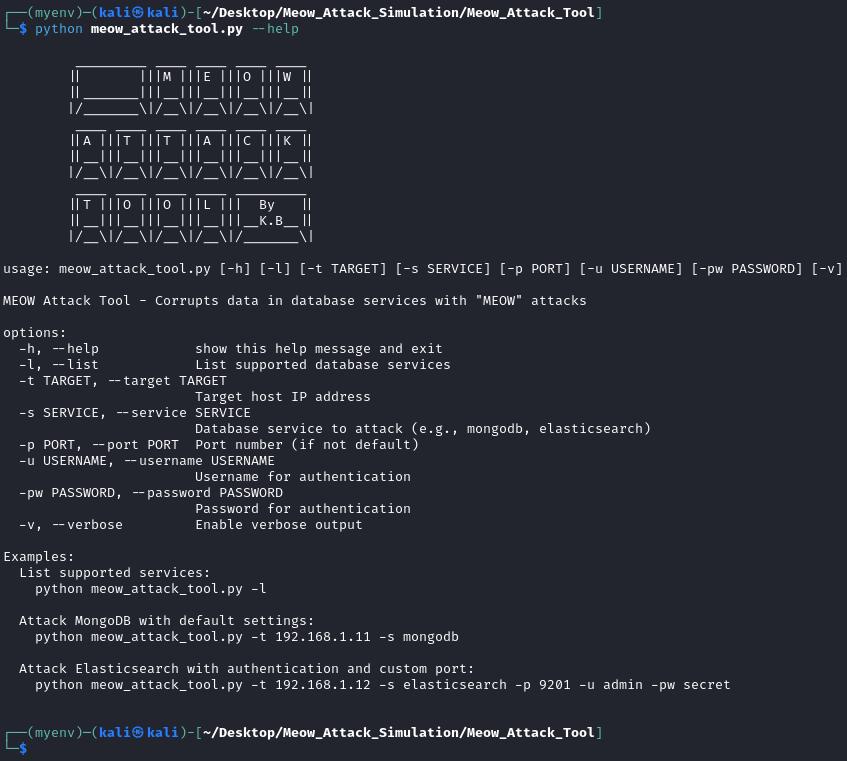
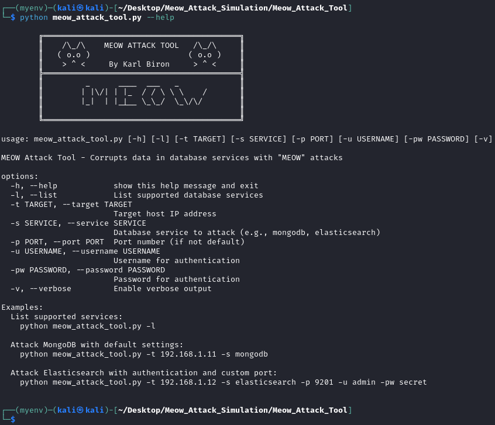
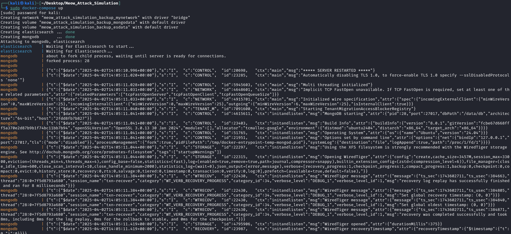
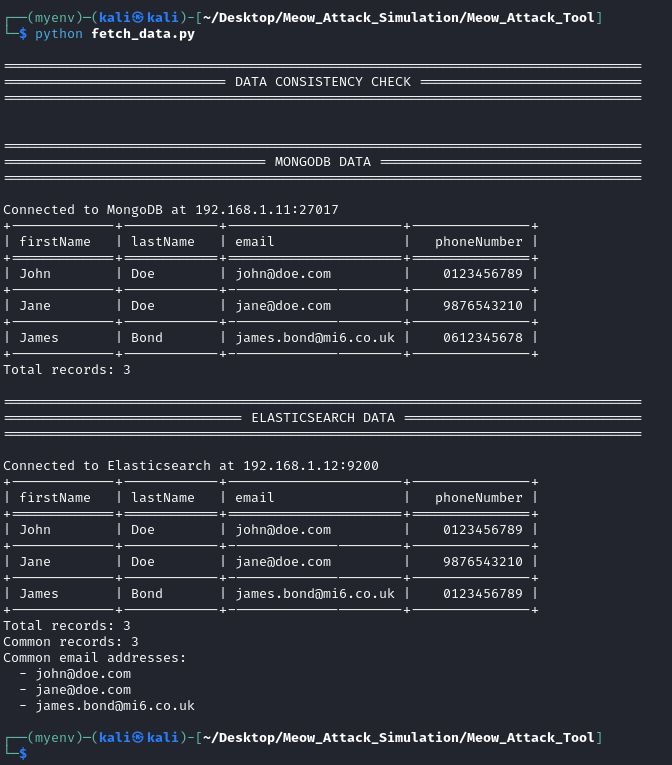
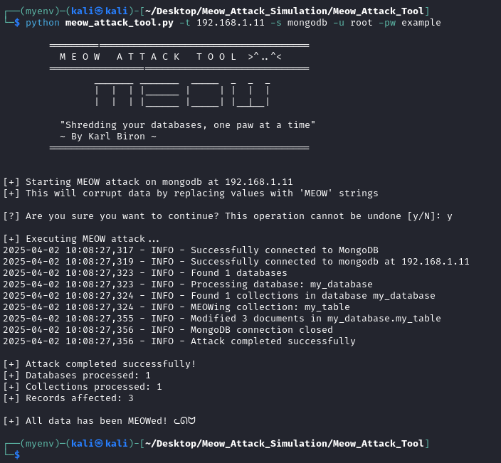
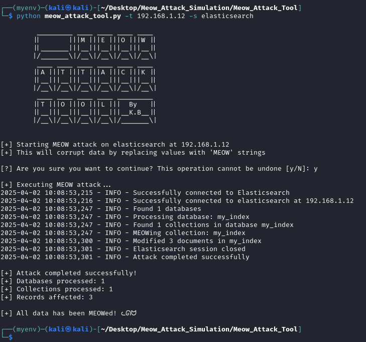
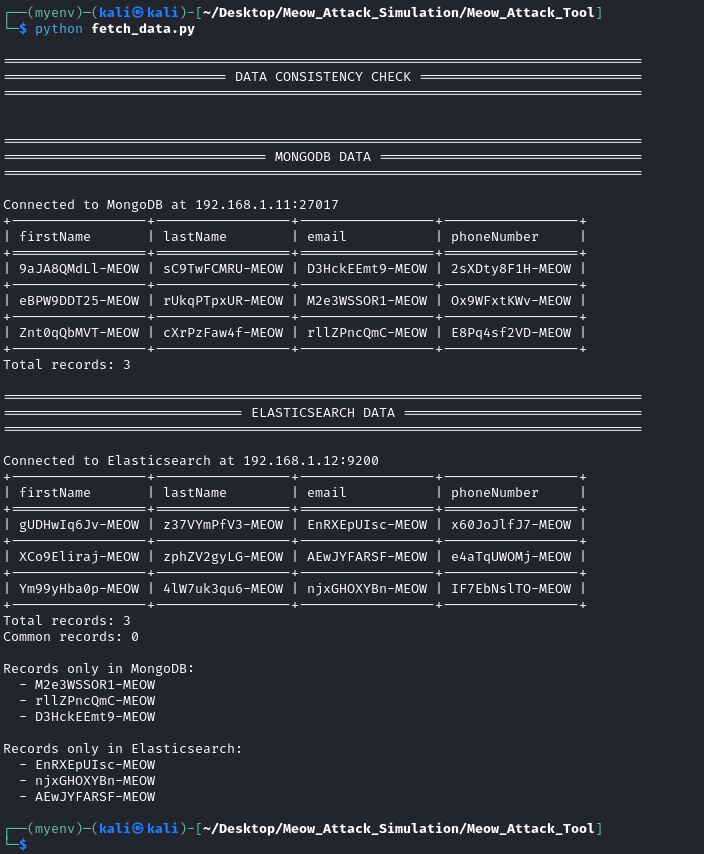

# Meow Attack Simulation Tool


## NOTES

The Meow Attack project has evolved beyond its initial script-based simulation and is now a full-fledged **Meow Attack Tool**. Due to this expansion, the tool has been moved to its own dedicated repository to better support ongoing development, modularity, and future enhancements.  

Currently, the tool supports targeting **MongoDB** and **Elasticsearch** instances, with additional database targets planned for future releases. 

A **credentialed attack feature** has also been introduced, allowing for more comprehensive security testing.  

For reference to the original Meow Attack Simulation, visit: [Meow Attack Simulation Repo](https://github.com/karlvbiron/Meow_Attack_Simulation).


## Installation

```bash
# Clone the repository
git clone https://github.com/karlvbiron/Meow_Attack_Simulation.git

# Navigate to the tool directory
cd Meow_Attack_Simulation/Meow_Attack_Tool

# Install dependencies
pip install -r requirements.txt
```

## Command Line Arguments

| Argument | Description |
|----------|-------------|
| `-l`, `--list` | List supported database services |
| `-t`, `--target` | Target host IP address |
| `-s`, `--service` | Database service to attack (e.g., mongodb, elasticsearch) |
| `-p`, `--port` | Port number (if not default) |
| `-u`, `--username` | Username for authentication |
| `-pw`, `--password` | Password for authentication |
| `-v`, `--verbose` | Enable verbose output |

## Example Scenarios

### MongoDB Simulation (Credentialed)

```bash
python meow_attack_tool.py -t 192.168.1.11 -s mongodb -u root -pw example
```

### Elasticsearch Simulation (Non-Credentialed)

```bash
python meow_attack_tool.py -t 192.168.1.12 -s elasticsearch
```

## Project Structure

```
Meow_Attack_Tool/
├── init.py
├── core/
│   ├── init.py
│   ├── base_attacker.py
│   └── attack_factory.py
├── attackers/
│   ├── init.py
│   ├── mongodb.py
│   └── elasticsearch.py
├── utils/
│   ├── init.py
│   └── logging.py
└── meow_attack_tool.py
```

## Banners (Random Selection)

 
 \



## Attack Sequence Demonstartion

1. Start the Docker Database Targets


2. Check the INITIAL state of the database data via the `fetch_data.py` script 


3. Execute on the MongoDB dockerized target


4. Execute on the Elasticsearch dockerized target


5. Check the AFTERMATH state of the database data via the `fetch_data.py` script 


## Disclaimer

This tool is provided for **EDUCATIONAL PURPOSES ONLY**. It is designed to demonstrate a type of cyber attack in a controlled environment to help improve security awareness and defensive measures. Using this tool against systems without proper authorization is illegal and unethical. The authors and contributors are not responsible for any misuse of this software.

## License

This project is licensed under the MIT License - see the LICENSE file for details.
